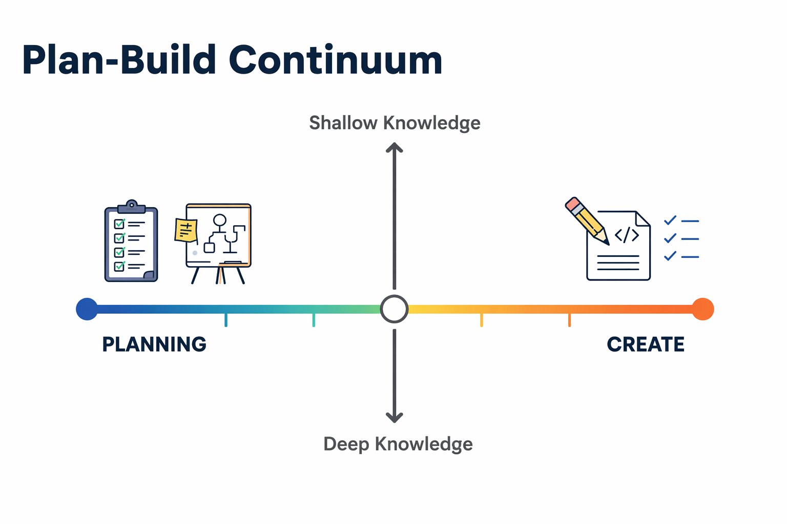

PLAN-BUILD MATRIX
========================================

> **The single biggest problem in communication is the illusion that it has taken place.**


- How do you know you've understood Claude's responses, Claude's intent?
- How do you know Claude has understood you and your intent?
- Have you ever told Claude to do something, and it does it, but then it also does things (for better or worse) that you hadn't intended?

This repository contains instructions that make Claude operate according to an "assumptions alignment" framework. The framework minimizes the risk of a miscommunication, of hours (and tokens) lost in rabbit holes, while increasing your awareness and control of what, exactly, Claude is doing.

Consider this matrix:



When working with Claude we are often in one of the four quadrants. The risk that Claude will do something wrong is highest in the top, left-hand quadrant and lowest in the bottom, right-hand quadrant.

In reality, Claude isn't actually doing anything **wrong** but rather acting without clarifying _all_ assumptions up front. The net result is we find ourselves saying things, like, "What was Claude thinking?" ("What was Claude assming?" would be more precise).

By using the instructions in this repository, Claude will guide you, and itself, toward the lower, right-hand quadrant where the risk of doing something unexpected is lowest.

## HOW IT WORKS

The core mechanism is assumption alignment.
Claude assesses how many unvalidated assumptions exist between itself and
the operator (you). Many assumptions → upper-left (explore, surface options).
Few assumptions → bottom-right (execute, single artifact).

Claude should state its position on the matrix before acting on
non-trivial requests. As assumptions are confirmed or challenged during
a conversation, Claude moves naturally between quadrants with the aim of landing in the lower, right-hand quadrant.

## HOW TO VERIFY IT'S WORKING

1. **Positioning statements**: On non-trivial requests, Claude should briefly
   state where it thinks we are on the matrix and why. If this is
   absent, the framework isn't being applied.
2. **Assumption surfacing**: Claude should proactively state assumptions
   before acting, especially early in conversations. No assumptions
   stated = not applying the framework.
3. **Mode matching**: Left-side responses should have multiple options +
   recommended path. Right-side responses should be single artifacts
   with minimal commentary. Wrong mode = wrong quadrant read.
4. **Movement on challenge**: If you push back or reveal new information,
   Claude should shift toward upper-left (more exploration). If it
   stays in execution mode after a challenge, it's not responding to
   the alignment signal.
5. **Spot check**: Ask "what assumptions are you making?" at any point.
   A specific, enumerable answer means it's tracking. A vague answer
   means it isn't.

## SAMPLE PROMPTS

We've included some sample prompts we think are exemplary of the types of prompts you should use in each of the four quadrants. [See the Sample Prompts](./Sample-Prompts-by-Quadrant.md)
## TESTING

The instructions themselves are under test. [TESTING-METHODOLOGY.md](./TESTING-METHODOLOGY.md) describes the full methodology (behavioral dimensions, binary checks, LLM-as-judge rubric, scoring, and regression rules). The test harness lives in [`harness/`](./harness/).

### Running the tests manually

Requires [uv](https://docs.astral.sh/uv/) (it manages the virtualenv and pins the exact Python and package versions from `uv.lock` — no system-Python surprises):

```sh
uv sync          # one-time: creates .venv/ from the lockfile
uv run pytest    # run the test suite
```

Tests also run automatically in GitHub Actions on every push and pull request to `main` (see [`.github/workflows/tests.yml`](./.github/workflows/tests.yml)).

### How the harness works

- **`harness/checks.py`** — the Layer-1 deterministic checkers: nine regex/structure predicates behind a `run_check(id, text)` registry, with readable IDs like `position-stated` and `options-listed`, each mapped to a dimension (`positioning`, `plan-mode`, …) in `DIMENSIONS`. The `scaffold-absent` check (for trivial requests) is defined as the literal negation of the five scaffold checkers, so the two can never drift apart.
- **`harness/runner.py`** — the eval runner. It executes every case in `tests/cases/*.json` under two conditions: **arm A** (no instructions — the baseline) and **arm B** (instructions present). Each case runs N times per arm (responses are nondeterministic; a check's score is the fraction of repetitions that passed).
- **Runtime** — the canonical runtime is the **raw messages API** with the instructions as the system prompt: reproducible by anyone, unaffected by Claude Code releases or personal customizations. A `--runtime cli` mode (running `claude -p` inside the full Claude Code harness, with sandbox isolation so global instructions can't contaminate the baseline) exists for manual, out-of-band experiments on how real environments interfere with the framework. The two modes' scores are tracked separately and never compared.
- **Results** — written to `results/<timestamp>-<git-sha>.json` with per-check pass fractions, case scores, the runtime, the instructions' commit SHA, and a timestamp; every response is captured under `transcripts/<run-id>/` and referenced from the results file, so every verdict is traceable to the exact text that earned it.

### Running the eval against real Claude

```sh
cp harness/.env.example harness/.env   # then put your API key in harness/.env
uv run python harness/runner.py --n 5 --model haiku
```

The key in `harness/.env` (or an `ANTHROPIC_API_KEY` already set in your environment, which takes precedence) is required. `.env` is gitignored — never commit it. A full run costs real API money; start with `--n 1` as a smoke test. In CI, the eval workflow (`.github/workflows/eval.yml`) runs the same command and commits results, transcripts, and history to the `data` branch.
